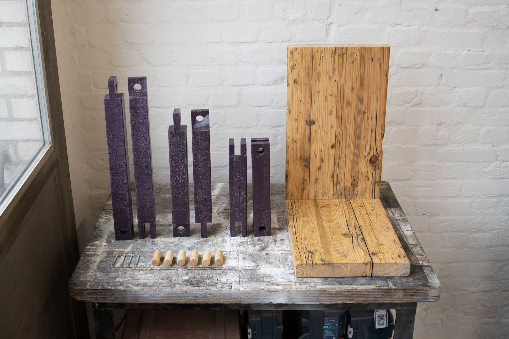

<!--
SPDX-FileCopyrightText: regenholz <mail@regenholz.de>

SPDX-License-Identifier: CC-BY-SA-4.0
-->

# Upcycling stool and side table furniture "Precious Hocker"

## Precious Hocker - Hardware Description

The "Precious Hocker" is an upcycling product used as a sitting stool or as a piece of furniture for storage in the living room (laptop, tablet, magazines, drinks, snacks, plants, etc.). The wood comes from discarded spruce planks from scaffolding construction, the plastic frame is cast from plastic waste (shredded plastic lids).

{width=500px} {width=500px}

**Object:**

- Dimensions approx. 550x350x450 mm
- Weight approx. ??? kg
- 

## Key Ressources

- [BOM file](bom.csv)
- [Dimensions](src/mech/dimension-drawing.md)
- [Workshop Description](doc/workshops/build/workshop-description+agenda_de.md)
- [Step-by-Step-Guide](doc/workshops/build/step-by-step_build-guideline.md)

## License

Hardware design, CAD and PCB files, BOM, settings and other technical or design files are released under the following license:
- CERN Open Hardware Licence Version 2 Weakly Reciprocal - **[CERN-OHL-W](/LICENSES/LICENSE_CERN_OHL_W_V2.txt)**

Assembly manual, pictures, videos, presentations, description text and other type of media are released under the following license:
- Creative-Commons-Attribution-ShareAlike 4.0 International - **[CC BY-SA 4.0](/LICENSES/LICENSE_CC_BY_SA_4.0.txt)**
